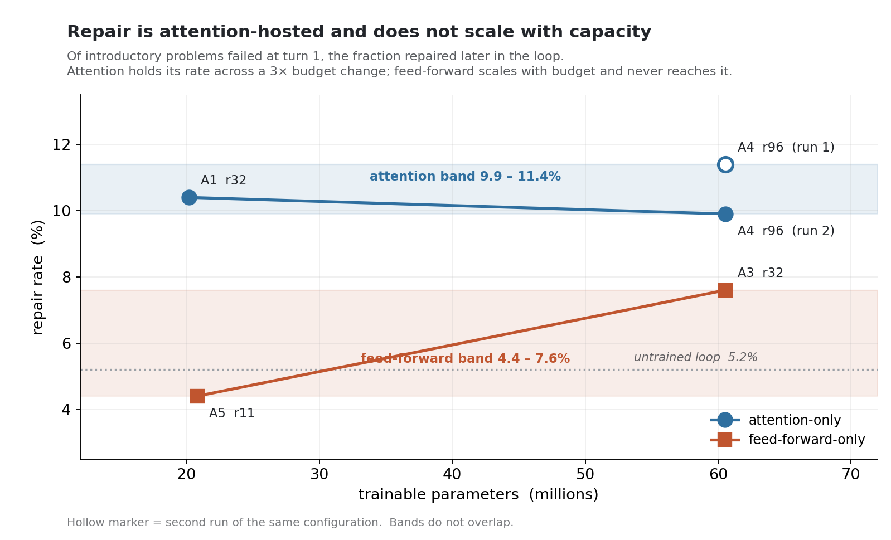
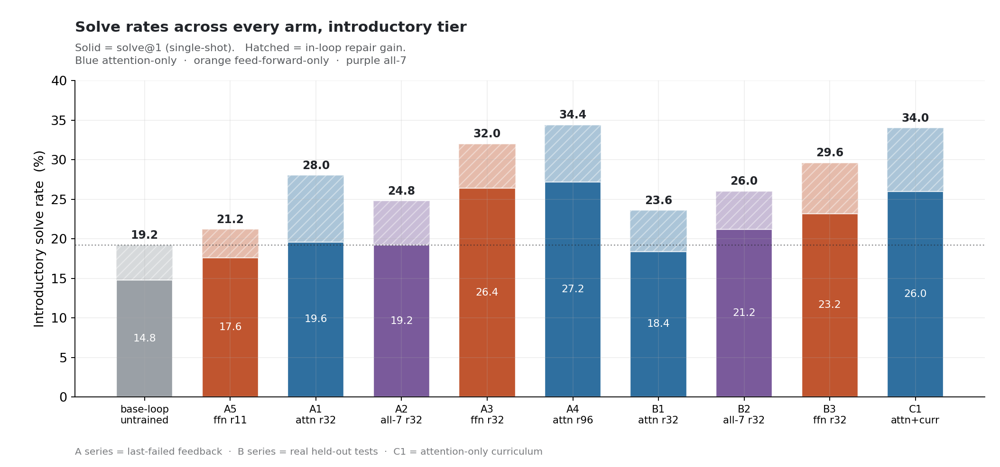
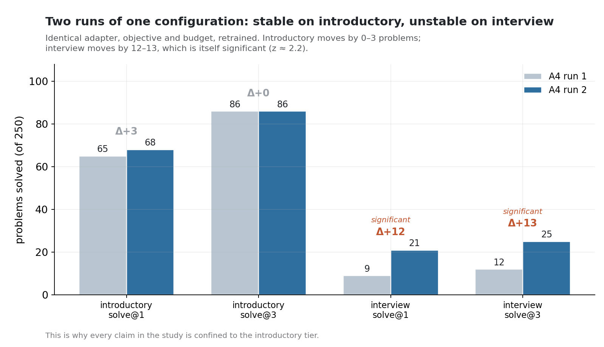
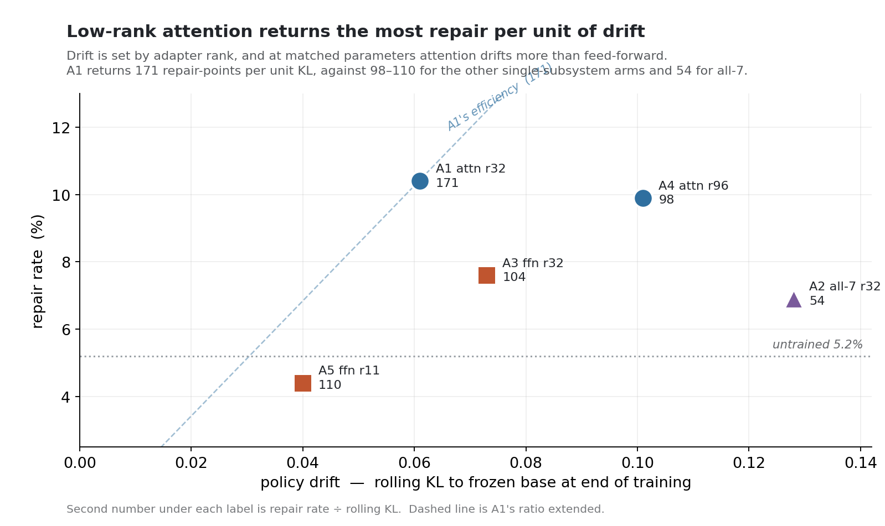
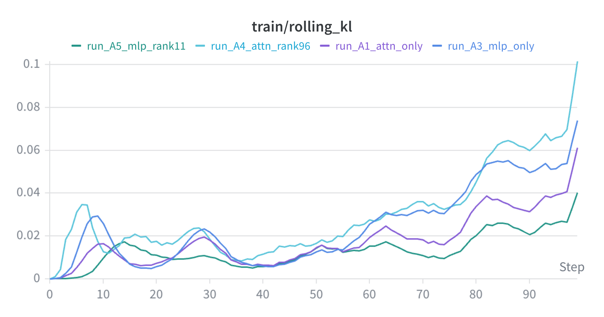

# RLEF-Code

**Reinforcement learning from execution feedback for multi-turn code generation — a 7B
model taught to repair its own code, trained end-to-end on a single GPU.**

RLEF-Code is a from-scratch multi-turn **GRPO** pipeline that teaches
Qwen2.5-Coder-7B-Instruct to iterate against real execution feedback: write code, run it
against held-out tests, read the failure, revise. It runs on the APPS dataset across all
three difficulty tiers, and it exists to answer a mechanistic question, rather than chase a
leaderboard: **when a model learns to repair its own errors, which part of it does
the learning?**

The hypothesis comes from the interpretability view that a transformer's feed-forward
layers act as key–value **memories** (Geva et al., 2021) while attention **moves and
combines** information. If repair is fundamentally about re-reading a problem in light of
what went wrong, it should be reachable by adapting *where the model attends* rather than
*what it stores*. Five adapter arms test that — attention projections and feed-forward
layers, each at two trainable-parameter budgets, plus a combined arm — so that **subsystem
and capacity vary independently**, with results compared problem by problem as well as in
aggregate.

> **The finding.** Error repair is hosted by the **attention projections**, and it does not
> scale with capacity. Attention holds a repair rate of **9.9–11.4%** across a 3× budget
> change; feed-forward adaptation reaches **4.4%** at the same budget and **7.6%** at three
> times that budget. The two bands do not overlap. Conditioned on the *same* failed
> problems, attention repairs significantly more (McNemar **p = 0.017**), while
> feed-forward at attention's budget is **indistinguishable from no training at all**
> (p = 1.000 against the untrained loop).
>
> **Single-shot capability is a different quantity**: capacity-bound and largely
> subsystem-agnostic, converging at the high budget (27.2% against 26.4%). And a
> staged attention-only curriculum matches the best rank-96 result on **one third** of its trainable parameters.

The object of study is **error-conditioned repair**: converting a localised, verified failure into a passing attempt,
with detection and localisation supplied by the harness. What the ablation identifies is where that behaviour
is **learnable** — which parameters to adapt if you want a model to acquire it.
[SETUP §1](SETUP.md#1-what-the-study-measures) makes this precise.

**Live experiment tracking:**
[W&B — rlef-code2 workspace](https://wandb.ai/tarunbeerelli-northeastern-university/rlef-code2/workspace)

**Read next:** methods and reproducibility → **[SETUP.md](SETUP.md)** · results, paired
analysis, and scope → **[RESULTS.md](RESULTS.md)**

---

## The result



**Repair rate** is the fraction of problems failed at turn 1 that are solved later in the
loop. It controls for starting level, which a raw solve@3 − solve@1 gap does not: an arm
starting at 26% has fewer failures left to repair than one starting at 19.6%.

Reading the two lines is the argument. Attention is flat across a 3× capacity change.
Feed-forward rises with capacity and still never enters attention's band — and at
attention's own budget it sits *below* the untrained baseline. Every figure here is
**greedy, single-generation**, scored on strict whole-question success over a fixed
713-problem held-out set.



---

## Reliability, measured



One configuration was trained twice, to put a measured number on run-to-run reliability. Introductory scores moved by 0–3 problems; interview scores moved by 12–13, which
is itself significant (z ≈ 2.2).

That result confirms the design. The dense reward targets problems a few edits from correct,
which is the introductory tier; the harder tiers turn on algorithm-switching that the reward
does not pay for, and their low base rates leave them dominated by problems sitting at the
threshold of solvability. The introductory tier is where the instrument is pointed and where
it resolves. Measured variance: **±1 problem** for re-scoring one checkpoint, **±3** for
retraining on introductory, **±12** for retraining on interview.

---

## Cost of the capability



Training reward barely distinguishes the arms — their success curves lie almost on top of one
another. Drift does:



Drift rises with adapter rank and with parameter count, and at matched parameters attention drifts
more than feed-forward (0.061 against 0.040 at ~20 M; 0.101 against 0.073 at 60.56 M). What
distinguishes attention at low rank is the return: the rank-32 attention arm yields 171
repair-points per unit KL, against 98–110 for the other single-subsystem arms and 54 for all-7.
Low-rank attention adaptation is the efficiency optimum, and the curriculum stages from exactly there.

---

## A deliberately single-GPU design

Every run was produced on **one NVIDIA H200 (141 GB HBM3e, ~4.8 TB/s)** in bf16, with vLLM
and PyTorch **co-resident**: vLLM generates rollouts (async, prefix caching, LoRA
hot-loading) while PyTorch runs the GRPO update, sharing the card through a tuned memory
split. For a controlled mechanistic study this is the right instrument.

- **The updated policy is immediately available to the generator.** The dominant per-step
  cost in distributed online RL is broadcasting fresh policy weights to rollout workers.
  Co-residency removes that step: the trained LoRA hot-loads into the same vLLM instance,
  with no inter-node transfer and no base-model movement.
- **Sequential per-question processing keeps one request in command of the card.** PyTorch
  handles one problem at a time — its full group of 12 generations — with gradient
  accumulation across the batch. Peak memory tracks a single group instead of a batched fleet,
  the ~15k-token multi-turn KV cache always fits, and a trajectory that blows up is dropped
  mid-step without discarding accumulated gradients.
- **A self-verifying execution sandbox sits inside the loop.** Two harnesses (call-based and
  stdin/stdout), token-normalised comparison, recursive output canonicalisation, a
  structured error taxonomy, and a boot-time self-test that certifies the harness against
  known-correct and known-wrong solutions **before any GPU spend**.
- **Determinism the comparison depends on.** Without FSDP sharding, all-reduce ordering or
  multi-node flakiness, the seeded splits are reproducible — a precondition for paired
  per-problem comparison, and what makes the retrain variance above attributable to training
  rather than to bookkeeping.
- **A custom multi-turn loop, by necessity.** OpenRLHF and TRL target single-turn RLHF and
  do not host an execution environment inside the rollout, so the loop is built from
  scratch; keeping it single-device is what kept the memory split and the OOM guard
  calibratable.

Full infrastructure detail and every hyperparameter:
[SETUP §7](SETUP.md#7-infrastructure-and-hyperparameters).

---

## Problem formulation, briefly

Iterative code generation with execution feedback is a **finite-horizon Markov Decision
Process** $(\mathcal{S},\mathcal{A},P,R,H)$: a state $s_t$ is the running context (the
problem plus prior attempts and their feedback), an action $a_t$ is the tokens emitted at
turn $t$, the transition is the deterministic sandbox appending executed feedback, the
reward is a **verifiable** execution pass rate on held-out tests, and the horizon $H$ —
the `max_turns` setting, 3 throughout — bounds the loop. The policy is optimised with
**critic-free GRPO**. Full formalism, reward design, feedback regimes and hyperparameters:
**[SETUP.md](SETUP.md)**.

The reported metric is **solve@k** — solved within a $k$-turn feedback loop under greedy
decoding — and deliberately not the $k$-sample `pass@k` estimator of Chen et al. (2021);
see [RESULTS §3](RESULTS.md#3-how-to-read-the-numbers).

---

## Repository layout

```
src/rlef/
  data.py                    # APPS loader (stdin vs fn_name, difficulty buckets)
  prompt.py                  # dynamic system prompt, few-shot anchoring, XML parser
  reward.py                  # execution sandbox: dual harness, self-test, test verifier
  train_agent.py             # multi-turn GRPO, reward shaping, KL/OOM guards, checkpointing
  evaluate.py                # matched-harness solve@1 / solve@k evaluator (+ --baseline)
  prepare_openrlhf_data.py   # dataset build, stratified/curriculum sampling, manifest, eval-set gen
configs/                     # per-run train.yaml (rewritten by the pipeline)
scripts/
  setup_cloud.sh             # bootstrap: env, logins, data build/purge, sandbox self-test, unit tests
06_adapter_overlap.py        # paired per-problem analysis (capacity grid, McNemar, degeneration)
06_adapter_overlap.txt       # committed output of the above
results/                     # granular per-problem eval JSON
tests/                       # unit tests
assets/                      # figures used by the docs
```

---

## Quickstart

```bash
# 0. bootstrap a fresh instance: environment, HF + W&B auth, APPS download and purge,
#    sandbox self-test, unit suite. Halts before any GPU spend if a check fails.
bash scripts/setup_cloud.sh

# 1. re-certify the execution sandbox on demand
python src/rlef/reward.py          # must print ALL GOOD

# 2. build data for the current run config (generates the eval set if missing)
PYTHONPATH=src python src/rlef/prepare_openrlhf_data.py

# 3. establish the baseline (untrained model, identical harness)
PYTHONPATH=src python src/rlef/evaluate.py --baseline

# 4. train and evaluate
PYTHONPATH=src python src/rlef/train_agent.py
PYTHONPATH=src python src/rlef/evaluate.py

# 5. paired per-problem analysis across arms
python 06_adapter_overlap.py --results-dir results
```

---

## The arc of the study

Single-shot GRPO on attention parameters leaves single-shot capability statistically
unchanged, which is what makes later in-loop gains attributable to repair rather than raw
competence. Attention-only multi-turn training then opens a real `solve@1 → solve@3` gap.
The feed-forward arm initially appeared to be the stronger capability lever — until
capacity-matched controls showed that advantage was **trainable-parameter count**, while the
repair advantage is attention's and survives matching. A self-graded objective collapses into
reward-hacking exactly where the instrumentation predicted. An attention-only curriculum matches the rank-96 arm on a third of its parameters.
And a duplicated configuration puts a
measured number on run-to-run reliability, which is what fixes the resolution of every claim
that follows.

Full numbers, paired tests, and scope: **[RESULTS.md](RESULTS.md)**.

---

*Reference: Gehring, Zheng, Copet, Mella, Cohen, Synnaeve, "RLEF: Grounding Code LLMs in
Execution Feedback with Reinforcement Learning," ICML 2025 (arXiv:2410.02089).*
