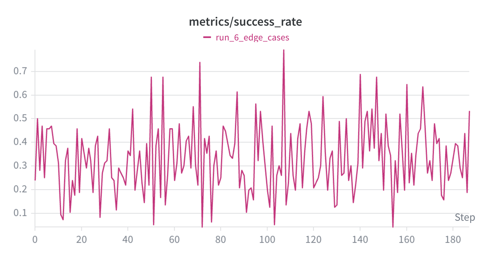
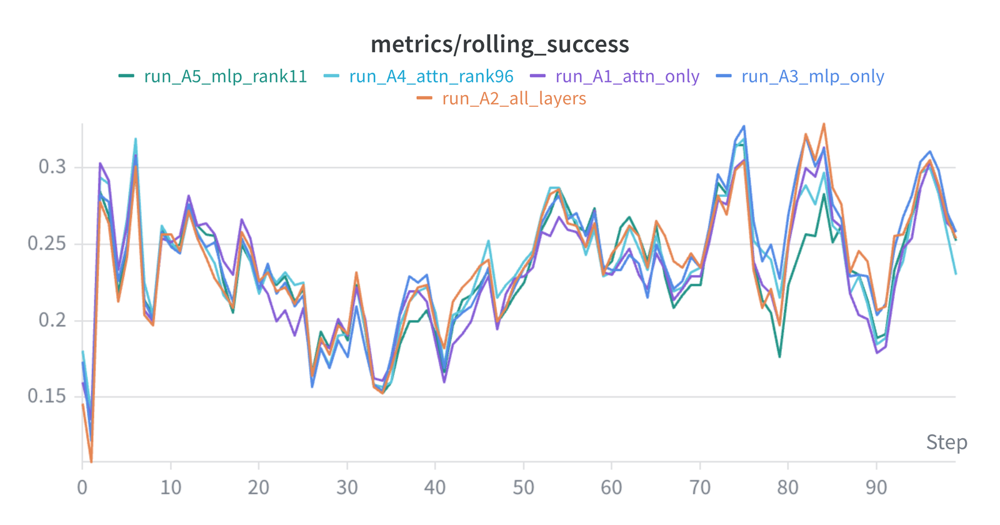
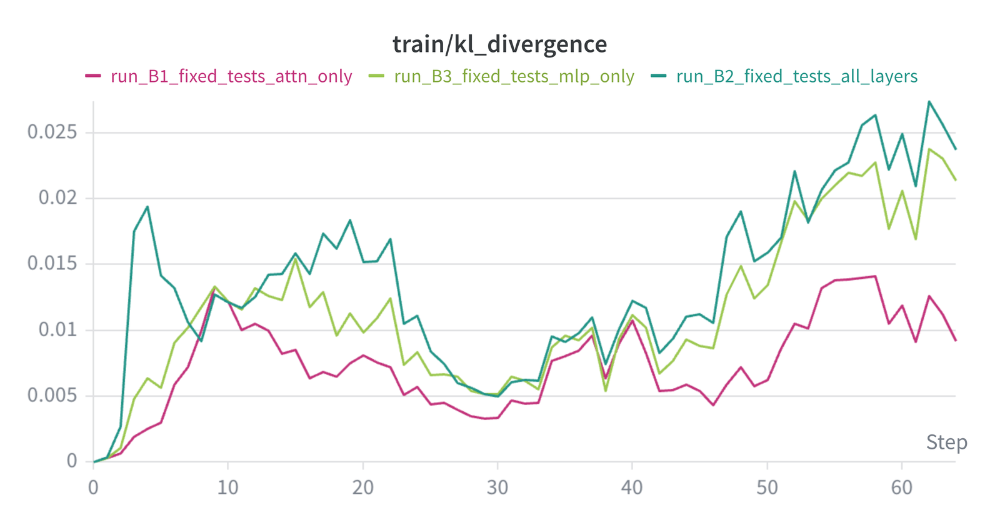
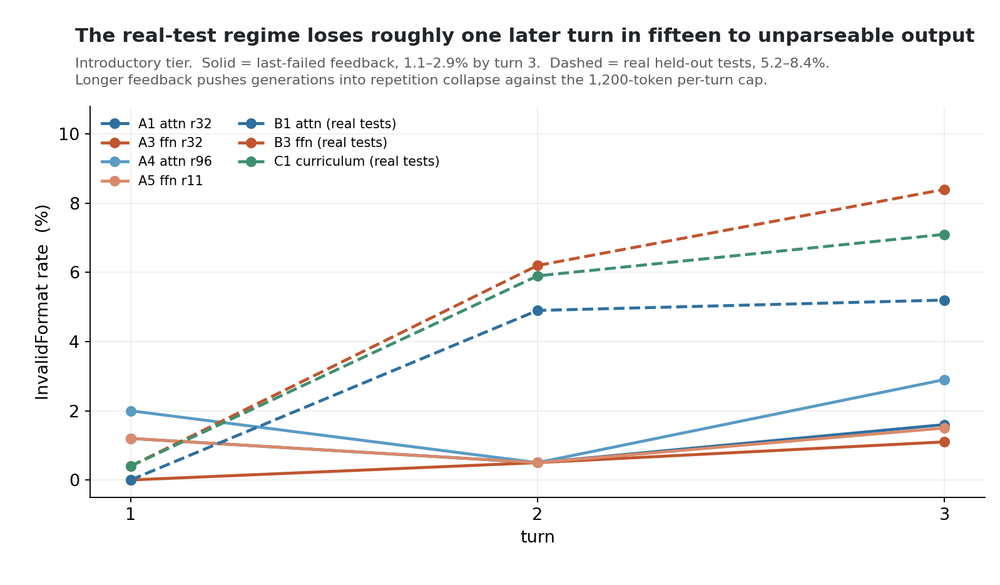

# RLEF-Code — Results & Analysis

*Methods: **[SETUP.md](./SETUP.md)**. Overview: **[README.md](./README.md)**. The paired analysis in
§6 is reproducible via [`06_adapter_overlap.py`](./06_adapter_overlap.py); its committed output is
[`06_adapter_overlap.txt`](./06_adapter_overlap.txt).*

**Live experiment tracking:**
[W&B — rlef-code2 workspace](https://wandb.ai/tarunbeerelli-northeastern-university/rlef-code2/workspace)

---

## 1. The question and the answer

> **When a model learns to repair its own errors under execution feedback, which part of it does the
> learning?**

The study set out to show that the behaviour is attention-hosted. A five-arm ablation with capacity
held fixed supports that, while overturning two intermediate claims along the way.

> **Repair is hosted by the attention projections, and it does not scale with capacity.** Attention
> holds a repair rate of **9.9–11.4%** across a 3× trainable-parameter change; feed-forward reaches
> **4.4%** at the same budget and **7.6%** at three times that budget. The bands do not overlap.
> Conditioned on the *same* failed problems, the attention arm repairs significantly more
> (McNemar **p = 0.017**), and feed-forward at attention's budget is **indistinguishable from no
> training at all** (p = 1.000 against the untrained loop).
>
> **Single-shot capability is a different quantity**: capacity-bound and largely subsystem-agnostic,
> converging at the high budget (27.2% against 26.4%). What looked initially like a feed-forward
> capability advantage was trainable-parameter count.
>
> **Staging substitutes for capacity.** An attention-only curriculum reaches 34.0% introductory
> solve@3 at 20.19 M parameters, against a rank-96 attention arm's 34.4% at 60.56 M.

Three boundaries, stated once and honoured throughout. Repair here means **refinement** under a dense
reward ([SETUP §3](./SETUP.md#3-reward-design--the-decision-everything-turns-on)). The result is a
**learnability locus**, not a representational one
([SETUP §1](./SETUP.md#1-what-the-study-measures)). And **all claims are confined to the introductory
tier**, for a reason given in §2.

---

## 2. Reliability, and where the instrument resolves

One configuration (A4) was trained twice to put a measured number on run-to-run reliability
rather than assume it.

| | run 1 | run 2 | Δ | z |
|---|---|---|---|---|
| introductory solve@1 | 65 | 68 | +3 | −0.30 |
| introductory solve@3 | 86 | 86 | 0 | 0.00 |
| interview solve@1 | 9 | 21 | +12 | −2.26 |
| interview solve@3 | 12 | 25 | +13 | −2.22 |

Two draws from an identical configuration agree on the introductory tier and diverge
significantly on the interview tier. Measured repeat-measurement variance:

| Source | Introductory | Interview |
|---|---|---|
| re-scoring one checkpoint | ±1 problem | ±1 problem |
| retraining one configuration | ±3 problems | **±12 problems** |

**This confirms the design.** The dense reward pays for refinement, so it targets problems a
few edits from correct — the introductory tier
([SETUP §3](./SETUP.md#3-reward-design--the-decision-everything-turns-on)). The harder tiers
turn on algorithm-switching the reward does not incentivise, and their low base rates leave
them dominated by problems sitting at the threshold of solvability: with 9–25 solves out of
250, the tier measures which of those flip rather than a stable property. Introductory is
where the instrument is pointed and where it resolves, so that is where the analysis lives.
Hard-tier figures appear in the table below for completeness.

Re-scoring variance is separately traceable to timeout non-determinism: a baseline re-score
moved Timeout events 1,790 → 2,649 with introductory solve@1 unchanged.

## 3. How to read the numbers

- **solve@1** — greedy, **turn 1 only**. Single-shot capability.
- **solve@k** — solved anywhere **within the loop** (k = `max_turns` = 3), greedy.

`solve@k` is the **loop** sense and not the $k$-i.i.d.-sample `pass@k` estimator of Chen et al. (2021).

**Why greedy.** Multi-sample evaluation would lift every number but measures *search budget* rather
than the capability training moves. Greedy adds a guarantee specific to this study: turn 1 is
deterministic, so a `solve@k > solve@1` gap can only come from the appended feedback changing the next
attempt.

**Repair rate** is the primary metric: of problems failed at turn 1, the fraction solved later in the
loop. It controls for starting level, which the raw gap does not — an arm starting at 26.4% has fewer
failures left to repair than one starting at 19.6%. Where two arms are compared, the **paired** form is
preferred: restricted to problems *both* arms failed at turn 1, so the comparison cannot be explained by
one arm simply solving more at first attempt.

Held-out set, fixed across all runs: **250 introductory, 250 interview, 213 competition (713 total)**.

---

## 4. Results

Greedy, single-generation, strict whole-question success. Repair rate on the introductory tier.
*Hard-tier columns are listed for completeness; the analysis runs on the introductory tier (§2).*

| Run | Adapter | Rank | Params | I s@1 | I s@3 | repair | V s@1 | V s@3 | C s@3 | ov s@3 |
|---|---|---|---|---|---|---|---|---|---|---|
| `base-single` | — | — | — | 17.2 | — | — | 2.8 | — | — | — |
| `base-loop` | — | — | — | 14.8 | 19.2 | 5.2% | 2.8 | 2.8 | 0.47 | 7.85 |
| S1 | attn | 32 | 20.19M | 18.0 | — | — | 2.4 | — | — | — |
| **A5** | ffn | 11 | 20.82M | 17.6 | 21.2 | **4.4%** | 3.2 | 3.2 | 0.47 | 8.70 |
| **A1** | attn | 32 | 20.19M | 19.6 | 28.0 | **10.4%** | 3.6 | 4.8 | 0.47 | 11.64 |
| **A3** | ffn | 32 | 60.56M | 26.4 | 32.0 | **7.6%** | 10.0 | 12.0 | 1.41 | 15.85 |
| **A4** | attn | 96 | 60.56M | **27.2** | **34.4** | **9.9%** | 8.4 | 10.0 | 0.94 | 15.85 |
| A2 | all-7 | 32 | 80.74M | 19.2 | 24.8 | 6.9% | 4.4 | 5.2 | 2.35 | 11.22 |
| B1 | attn | 32 | 20.19M | 18.4 | 23.6 | 6.4% | 4.0 | 4.4 | 0.47 | 9.96 |
| B2 | all-7 | 32 | 80.74M | 21.2 | 26.0 | 6.1% | 7.6 | 9.6 | 1.88 | 13.04 |
| B3 | ffn | 32 | 60.56M | 23.2 | 29.6 | 8.3% | 7.6 | 10.8 | 1.88 | 14.73 |
| **C1** | attn | 32 | 20.19M | 26.0 | 34.0 | **10.8%** | 8.0 | 9.6 | 1.88 | 15.85 |

A1, A3, A4, A5 and A2 share the `last_failed` objective; B1–B3 use real held-out tests; C1 stages the
two. **A4's row reports its second run**; both runs appear in §2. D1, the self-graded arm, was scored on an earlier eval mix and is discussed in §5.4 for the collapse
it demonstrates, and is not compared numerically.

---

## 5. The experiments in sequence

### 5.1 Baselines and the single-shot control

`base-single` (one attempt, no feedback) scores **17.2%** introductory; `base-loop` (three turns,
untrained) scores **14.8% / 19.2%** and repairs **5.2%** of its turn-1 failures — the floor every trained
arm is measured against. The nominal turn-1 offset between the two baselines reflects the heavier
multi-turn prompt and is not significant (z = 0.73), but it is why trained runs are compared to the
matched `base-loop`.

**S1** trains single-shot on attention parameters and reaches **18.0%**, indistinguishable from
`base-single`'s 17.2% (z = 0.23). Attention adaptation alone does not move first-attempt capability, so
for the attention arms in-loop gains are not smuggled single-shot competence.

### 5.2 The capacity-controlled ablation

This is the core experiment. Four arms cross subsystem with trainable budget, everything else fixed.

| | ~20 M budget | 60.56 M budget |
|---|---|---|
| **attention** | A1: 19.6 / 28.0, repair **10.4%** | A4: 27.2 / 34.4, repair **9.9%** |
| **feed-forward** | A5: 17.6 / 21.2, repair **4.4%** | A3: 26.4 / 32.0, repair 7.6% |

Three separable readings.

**Repair is attention-hosted and capacity-invariant within measurement resolution.** Attention delivers
10.4% and 9.9% across a 3× budget change — and A4's first run gave 11.4%, so the attention band is
9.9–11.4% across three runs and two capacities. Feed-forward gives 4.4% and 7.6%, never entering that
band. At the low budget, feed-forward repairs *below* the untrained baseline.

**Single-shot level is capacity-bound and converges.** At 60.56 M the two subsystems are
indistinguishable (27.2 against 26.4, z = +0.20), and tripling the budget lifts both — the feed-forward
sweep gives z = +2.38 on solve@1 and +2.73 on solve@3, the attention sweep z = +2.01 and +1.54. What
appeared at rank 32 to be a feed-forward capability advantage was budget.

**All-7 is dominated.** A2 carries the most parameters, the most drift, and neither the best level nor
the best repair — replicating an established PEFT result (§6.4).

### 5.3 B series — real held-out tests

Replacing the shown case with a disjoint shown/graded partition removes the spoon-feeding and any
co-adaptation exploit. Ordering is preserved: **B3 (ffn) 23.2 / 29.6 > B2 (all-7) 21.2 / 26.0 > B1
(attn) 18.4 / 23.6**, with repair rates 8.3%, 6.1% and 6.4%.

Attention-only underperforms *from cold* in this regime — 6.4% repair against its own 10.4% in the A
series. The real-test signal is less direct, and a low-capacity attention adapter learning two things at
once (use the tests as a tool, and use feedback) acquires neither fully. That is the observation the
curriculum acts on. A more mechanical factor also depresses the B series, visible only in per-turn error
classes: the regime loses roughly one later turn in fifteen to unparseable output (§7).

### 5.4 D1 — self-graded tests and a Goodhart collapse

D1 has the model author its own tests before coding, then grades its code against them. The objective
collapsed: introductory solve@1 fell to **3.6%**, below the untrained baseline, while training KL climbed
monotonically.

The instructive part is the shape of the training curve. It stays high and even trends upward
(mean ≈ 0.35, swinging ~0.1–0.75 across ~190 updates) because it scores the model against a yardstick
the model itself is bending. Two forces produce the signature. The reward is computed on the model's own
tests, so as code and tests co-adapt, *self-reported* success stays high while real correctness does not
follow. And the metric tracks a group of 12 rollouts at temperature 0.7, so it effectively reports the
**best of the group**: a minority still follow the intended refinement path, and their intermittent
successes keep the aggregate elevated while most of the group converges on the exploit. Greedy
single-generation evaluation on real held-out tests then reports the **dominant** mode, and the number
collapses.

The methodological lesson: **greedy evaluation is the integrity check that a temperature-sampled,
multi-generation training curve cannot be.**

### 5.5 C1 — the curriculum

C1 warm-starts from the A-series attention policy and continues on hard-specialised **unseen** problems
under the real-test objective, still attention-only. It reaches **26.0 / 34.0** with the study's best
repair rate at **10.8%**, and gains that are individually significant against `base-loop`
(solve@1 z = +3.11; solve@3 z = +3.74).

Two results worth separating. Against **B1** — same adapter, same objective, cold rather than
warm-started — staging is nearly monotone (§6.3). And against **A4**, C1 reaches the same score at **one
third the trainable parameters** (34.0 at 20.19 M against 34.4 at 60.56 M, a one-problem difference and
therefore inside the noise floor). Staging is an alternative to capacity, not an approximation of it.

C1 was trained on **hard** problems yet its largest gains land on the **introductory** tier, which
suggests the repair behaviour is a transferable routing skill rather than a per-difficulty trick.

---

## 6. Paired per-problem analysis

Aggregate deltas of a few points on n = 250 cannot separate *more capacity* from *a different
mechanism*. The comparisons below are paired on problem identity and tested with McNemar's test, which
conditions on the same problems. Full output:
[`06_adapter_overlap.txt`](./06_adapter_overlap.txt).

### 6.1 The load-bearing test — repair on a shared failure set

Restricting to problems **both arms failed at turn 1** isolates repair from single-shot capability.
Introductory tier:

| Comparison | shared failures | A repaired | B repaired | discordant | McNemar |
|---|---|---|---|---|---|
| **A1 attn vs A5 ffn** (matched ~20 M) | 194 | 21 (10.8%) | 9 (4.6%) | 17 : 5 | **p = 0.017** |
| **A1 attn vs `base-loop`** | 194 | 21 (10.8%) | 8 (4.1%) | 17 : 4 | **p = 0.007** |
| **A5 ffn vs `base-loop`** | 200 | 8 (4.0%) | 9 (4.5%) | 6 : 7 | p = 1.000 |
| A4 attn vs A3 ffn (matched 60.56 M) | 166 | 14 (8.4%) | 11 (6.6%) | 8 : 5 | p = 0.581 |
| A4 attn vs A1 attn (3× capacity) | 175 | 17 (9.7%) | 12 (6.9%) | 9 : 4 | p = 0.267 |
| A3 ffn vs A5 ffn (3× capacity) | 174 | 12 (6.9%) | 6 (3.4%) | 12 : 6 | p = 0.238 |
| C1 curriculum vs A4 attn | 163 | 16 (9.8%) | 14 (8.6%) | 8 : 6 | p = 0.791 |

The first three rows are the argument. At matched budget attention repairs significantly more of the same
failures than feed-forward; attention training significantly adds repair over untrained iteration; and
feed-forward training at that budget adds **nothing measurable** — 8 repairs against the baseline's 9, on
200 shared failures.

The matched-capacity comparison at the *high* budget is directional but not significant (p = 0.581), and
the within-subsystem capacity sweeps are both non-significant — consistent with capacity mattering for
level rather than for repair.

### 6.2 Level: same score, different problems

At matched capacity, attention and feed-forward reach statistically identical introductory scores while
disagreeing about which problems they solve. A4 against A3 at solve@1: 68 against 66, **50 shared, 18
A4-only, 16 A3-only**, Jaccard 0.595, axis position +0.67, McNemar p = 0.864. A third of the combined
solve set belongs to exactly one arm, with a perfectly symmetric discordance.

The same holds for the curriculum against feed-forward — C1 against A3 at solve@1 gives 48 shared, 17 and
18 exclusive, p = 1.000; against B3 on a matched objective, 45 shared, 20 and 13 exclusive, p = 0.296.
Equal scores by different routes, throughout.

At the low budget the picture differs: A5 against A1 gives axis position **+0.80**, subsumption-like —
feed-forward at 20 M solves largely a subset of what attention solves there.

### 6.3 What staging bought

B1 is the cleanest control available: same adapter, same objective, differing from C1 only in the warm
start.

| | C1 | B1 | both | C1-only | B1-only | axis | McNemar |
|---|---|---|---|---|---|---|---|
| solve@1 | 65 | 46 | 41 | 24 | **5** | +0.85 | **p = 0.0008** |
| solve@3 | 85 | 59 | 53 | 32 | **6** | +0.85 | **p = 0.0001** |

The curriculum **nearly subsumes** its cold-start equivalent, retaining all but 5–6 of its solves while
adding 24 and 32. These are the two most significant paired results in the study, and they establish that
the phases **accumulate**: staging approximates monotone improvement. The matched control also sharpens a
figure available from the cross-regime comparison alone — against A1, C1 appears to lose 14 problems at
solve@3, but A1 trained on the other objective, so that number conflates the regime change with the
staging. Against B1, only 6 are lost.

### 6.4 The combined adapter

An appealing hypothesis: training attention alongside the feed-forward layers *disciplines* them toward a
routing solution. The B-regime pairs test it, since all three arms are available there.

| Pair (introductory) | Jaccard s@1 | Jaccard s@3 | axis s@1 |
|---|---|---|---|
| B2 all-7 vs B1 attention | 0.597 | 0.632 | +0.75 |
| B3 ffn vs B2 all-7 | **0.682** | **0.655** | **+0.80** |

All-7 sits **closer to the feed-forward solution than to the attention one** on both metrics. Combined with
all-7 carrying the highest drift while never leading, the disciplining reading does not survive: when both
subsystems are trainable, the optimum tracks feed-forward and the extra adapter buys drift rather than
behaviour. Gradient dilution at fixed learning rate is the more parsimonious account.

All-7 being dominated by its own feed-forward subset **replicates** an established PEFT result: MLP-only
adaptation matches or outperforms all-linear despite smaller capacity, usually attributed to the
key–value-memory account of feed-forward layers. Reproducing it here in an online RL setting, where the literature reports it from supervised
fine-tuning, is evidence the pipeline behaves as an instrument.

### 6.5 Two hypotheses tested and discarded

**Memorisation of shown test cases.** The design argued a priori that hard-coding could not work: with at
least 5 tests per problem and at most 2 revealed, a memorised case cannot produce a whole-question solve.
Two independent checks confirm it. The feed-forward advantage **persists in the B regime**, where shown and
graded sets are disjoint by construction. And shortcut incidence shows no consistent elevation — A3 at
5.47% and A4 at 4.91% against A1's 4.77% and a baseline 4.35%, with **B3 lowest of all runs at 2.34%**.

**Output-convention repair.** If the feed-forward arm were absorbing output formats from shown expected
values, it should repair *better* from `WrongOutput` failures. It repairs **worse**: 7.8% of 180 against
A1's 10.9% of 193, with C1 at 10.1%. The feed-forward advantage sits entirely at first attempt.

---

## 7. Training dynamics

**Reward does not distinguish the arms. Drift does.** Rolling success rate is nearly indistinguishable
across all five arms — including A4 at three times A1's parameters:

Rolling KL to the frozen base separates them cleanly. The trace below shows the four
capacity-grid arms; A2 (all-7) is tabulated with them:

| Arm | Rank | Params | rolling KL (end) | repair |
|---|---|---|---|---|
| A5 ffn | 11 | 20.82M | **0.040** | 4.4% |
| A1 attn | 32 | 20.19M | 0.061 | 10.4% |
| A3 ffn | 32 | 60.56M | 0.073 | 7.6% |
| A4 attn | 96 | 60.56M | 0.101 | 9.9% |
| A2 all-7 | 32 | 80.74M | 0.128 | 6.9% |

**Rank sets drift, not subsystem** — and at matched parameters attention drifts *more* than feed-forward,
0.061 against 0.040 at ~20 M and 0.101 against 0.073 at 60.56 M. Attention's advantage lies elsewhere.

At low rank it is the high-return lever. Repair per unit rolling KL: **A1 171**, A5 110, A3 104,
A4 98, A2 54. The optimum is not attention in general but **attention at rank 32**, which returns
roughly 1.6× the repair per unit drift of anything else and 3× that of all-7 — and the curriculum stages
from exactly there. Raising attention to rank 96 buys single-shot level at drift that repair does not
repay.

Two further observations. **B-series KL runs at roughly half the A-series' at matched step count**,
independent evidence that the seen-case objective offers more to chase:

And attention-only runs tend to reach their task capability early, around the 40th sub-batch update.

### Degeneration — a regime effect

Turn-3 `InvalidFormat` rate on the introductory tier runs **1.1–2.9% under `last_failed` feedback** and
**5.2–8.4% under real held-out tests**, matching the aggregate logs. Around 27–30 B-series records carry
empty completions, against none in the A series.

The mechanism is prosaic and fixable: real-test feedback surfaces more text per turn, contexts grow faster,
and generations run into the 1,200-token per-turn cap before emitting a parseable code block, collapsing
into repetition on the way. The B series therefore underperforms partly for a *mechanical* reason and not
only because its signal is harder to acquire — which makes the curriculum's result more impressive, and
suggests two concrete fixes: trim the shown-case feedback, or raise the per-turn cap.

---

## 8. Statistical significance

Tier sizes: n = 250 (I), 250 (V), 213 (C). The paired tests in §6 are the primary evidence; unpaired
two-proportion z-tests against `base-loop` on the introductory tier:

| Comparison | Δ | z | Significant |
|---|---|---|---|
| A4 solve@3 34.4 vs 19.2 | +15.2 | **+3.84** | yes |
| C1 solve@3 34.0 vs 19.2 | +14.8 | **+3.74** | yes |
| A3 solve@1 26.4 vs 14.8 | +11.6 | **+3.21** | yes |
| A4 solve@1 27.2 vs 14.8 | +12.4 | **+3.40** | yes |
| C1 solve@1 26.0 vs 14.8 | +11.2 | **+3.11** | yes |
| A1 solve@3 28.0 vs 19.2 | +8.8 | **+2.32** | yes |
| A3 vs A5 solve@1 (ffn sweep) | +8.8 | **+2.38** | yes |
| A4 vs A1 solve@1 (attn sweep) | +7.6 | **+2.01** | yes |
| A1 solve@1 19.6 vs 14.8 | +4.8 | +1.42 | no |
| A5 solve@1 17.6 vs 14.8 | +2.8 | +0.85 | no |
| S1 18.0 vs `base-single` 17.2 | +0.8 | +0.23 | no |

- **The paired tests are the stronger evidence where they apply**, because pairing removes between-problem
  difficulty variance. Where paired and unpaired disagree, the paired result is the one to trust.
- **All runs are single-seed except A4**, which has two; §2 quantifies what that costs.
- **The hard tiers are out of scope** (§2) and, at 1–5 problems out of 213, underpowered regardless.

---

## 9. Scope and roadmap

**What bounds the claims.**

- **Single seed for every arm but one.** A4's duplicate puts retraining variance at ~3 problems on the
  introductory tier; the findings sit above that floor, and replication heads the roadmap.
- **One model, one architecture ratio.** The exact 3× attention-to-feed-forward parameter ratio follows from
  this model's grouped-query attention (28 query heads to 4 KV heads). On a different ratio the capacity
  matching changes, and whether the finding is about function or these proportions is untested.
- **One benchmark, one reward shape.** The dense reward converts the task into a routing problem by design,
  which is what makes the question decidable and simultaneously bounds generality.
- **Learnability, not representation.** No activation-level evidence; LoRA sufficiency does not locate
  computation.
- **Hard tiers out of scope by design** (§2), and underpowered besides.
- **All-7 confounded by learning rate.** Fixed lr across arms means all-7's higher drift and lower return
  may reflect gradient dilution rather than anything about subsystem interaction.
- **Softer leakage control in the A regime.** Shown cases come from the graded set; §6.5 tests the residual
  empirically, but the B regime is the clean version.

**Roadmap, in priority order.**

1. **Three seeds of A1, A3 and A5.** If the repair bands stay disjoint, the central finding moves from
   indicated to established. This is now the only thing standing between the two.
2. **A second architecture with a different attention-to-feed-forward ratio**, to separate function from
   proportion.
3. **Fix the degeneration channel** (trim shown-case feedback, or raise the per-turn cap) and re-run the B
   series; roughly one later turn in fifteen is currently wasted.
4. **A larger held-out set**, which is the only route to making the hard tiers usable.
5. **Activation-level probes** — how attention over feedback tokens shifts across turns — to test the
   routing account mechanistically rather than behaviourally.
6. **A terminal all-parameter phase** after attention-only staging, the one place the drift cost is
   plausibly justified.

---

## 10. Conclusions

1. **Repair is attention-hosted.** Attention holds a repair rate of 9.9–11.4% across a 3× capacity change;
   feed-forward reaches 4.4% at matched budget and 7.6% at three times it. The bands do not overlap.
2. **The load-bearing test is paired and significant.** On 194 problems both arms failed at turn 1, the
   attention arm repaired 21 against the feed-forward arm's 9 (McNemar p = 0.017), and feed-forward at that
   budget is indistinguishable from no training at all (p = 1.000).
3. **Single-shot capability is a different quantity** — capacity-bound, subsystem-agnostic at the high
   budget (27.2 against 26.4), and more capacity-sensitive for feed-forward than for attention. The apparent
   feed-forward capability advantage at rank 32 was budget.
4. **Equal scores are reached by different routes.** At matched capacity the two subsystems disagree about a
   third of the problems they solve, with symmetric discordance (p = 0.864).
5. **Staging substitutes for capacity, and accumulates.** The curriculum matches a 3× larger adapter at one
   third the parameters, and against its own cold-start control adds 32 problems while losing 6 (p = 0.0001).
6. **Drift scales with rank, not with subsystem** — attention drifts more per parameter — but attention at
   rank 32 returns 171 repair-points per unit KL against 98–110 for the other single-subsystem arms and 54
   for all-7, making low-rank attention the efficiency optimum.
7. **Repair needs latent capability and honest feedback.** Untrained iteration repairs 5.2%; a self-graded
   objective collapses below baseline; real held-out tests succeed.
8. **Measurement discipline set the scope.** A duplicated configuration fixed the resolution of every
   claim, and two hypotheses — test memorisation and output-convention repair — were tested and discarded.
   What remains is what the measurements bear.

---

*Reference: Gehring, Zheng, Copet, Mella, Cohen, Synnaeve, "RLEF: Grounding Code LLMs in Execution Feedback
with Reinforcement Learning," ICML 2025 (arXiv:2410.02089).*